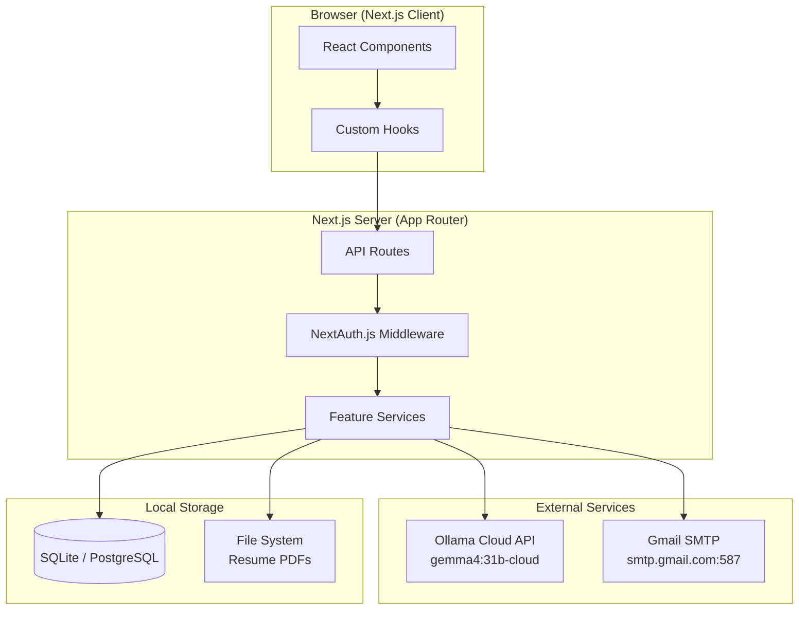
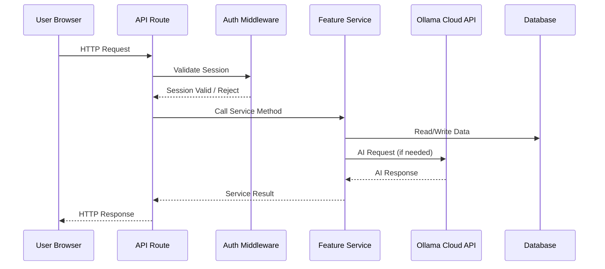

# Design Document: AI Job Dashboard

## Overview

The AI Job Dashboard is a full-stack Next.js application that enables job seekers to manage their application process through AI-powered tools. The system provides:

- Multi-user authentication with session management
- Resume upload, parsing, and storage
- AI-generated job application emails with direct SMTP sending
- ATS compatibility scoring using a hybrid keyword/LLM approach
- Interview preparation content generation

The application runs locally, uses SQLite (with optional PostgreSQL) for persistence, Ollama Cloud API (Gemma 4 31b-cloud) for AI operations, and Gmail SMTP for email delivery.

### Key Design Decisions

1. **Feature-based architecture**: Each subsystem maps to its own directory containing components, hooks, API routes, and services for maintainability and clear ownership.
2. **Hybrid ATS scoring**: Combines deterministic keyword/TF-IDF analysis (40%) with LLM semantic scoring (60%) for balanced accuracy.
3. **Database abstraction**: A repository pattern with Prisma ORM allows switching between SQLite and PostgreSQL via environment variable.
4. **AI service isolation**: A single AI service module handles all Ollama Cloud API communication, including retry logic, timeout, and input sanitization.
5. **Server-side AI calls**: All AI operations happen in Next.js API routes to protect the API key and control request flow.

## Architecture

### High-Level Architecture Diagram



### Request Flow



### Directory Structure

```
src/
├── app/
│   ├── layout.tsx
│   ├── page.tsx                    # Landing/login page
│   ├── (auth)/
│   │   ├── login/page.tsx
│   │   └── register/page.tsx
│   ├── (dashboard)/
│   │   ├── layout.tsx              # Authenticated layout with nav
│   │   ├── page.tsx                # Dashboard home
│   │   ├── resume/page.tsx
│   │   ├── email-generator/page.tsx
│   │   ├── ats-scorer/page.tsx
│   │   └── interview-prep/page.tsx
│   └── api/
│       ├── auth/[...nextauth]/route.ts
│       ├── resume/route.ts
│       ├── email/
│       │   ├── generate/route.ts
│       │   └── send/route.ts
│       ├── ats/route.ts
│       ├── interview-prep/route.ts
│       └── health/route.ts
├── features/
│   ├── auth/
│   │   ├── components/
│   │   ├── hooks/
│   │   ├── services/
│   │   └── types.ts
│   ├── resume/
│   │   ├── components/
│   │   ├── hooks/
│   │   ├── services/
│   │   └── types.ts
│   ├── email-generator/
│   │   ├── components/
│   │   ├── hooks/
│   │   ├── services/
│   │   └── types.ts
│   ├── email-sender/
│   │   ├── components/
│   │   ├── hooks/
│   │   ├── services/
│   │   └── types.ts
│   ├── ats-scorer/
│   │   ├── components/
│   │   ├── hooks/
│   │   ├── services/
│   │   └── types.ts
│   ├── interview-prep/
│   │   ├── components/
│   │   ├── hooks/
│   │   ├── services/
│   │   └── types.ts
│   └── ai-service/
│       ├── services/
│       └── types.ts
├── lib/
│   ├── db/
│   │   ├── prisma.ts               # Prisma client singleton
│   │   └── schema.prisma
│   ├── encryption.ts               # AES-256 for SMTP credentials
│   └── validation.ts               # Shared validation utilities
└── middleware.ts                    # NextAuth route protection
```

## Components and Interfaces

### Auth System

```typescript
// features/auth/services/auth.service.ts
interface AuthService {
  register(email: string, password: string): Promise<{ userId: string }>;
  validateCredentials(email: string, password: string): Promise<User | null>;
  checkLoginAttempts(email: string): Promise<{ locked: boolean; remainingMinutes?: number }>;
  recordFailedAttempt(email: string): Promise<void>;
  resetFailedAttempts(email: string): Promise<void>;
}

// features/auth/types.ts
interface User {
  id: string;
  email: string;
  passwordHash: string;
  createdAt: Date;
  updatedAt: Date;
}

interface LoginAttempt {
  email: string;
  failedCount: number;
  lastFailedAt: Date | null;
  lockedUntil: Date | null;
}
```

### Resume Store

```typescript
// features/resume/services/resume.service.ts
interface ResumeService {
  uploadResume(userId: string, file: Buffer, filename: string): Promise<ResumeResult>;
  getResumeText(userId: string): Promise<string | null>;
  deleteResume(userId: string): Promise<void>;
}

interface ResumeResult {
  success: boolean;
  extractedText?: string;
  error?: 'INVALID_TYPE' | 'SIZE_EXCEEDED' | 'EXTRACTION_FAILED' | 'LOW_TEXT_CONTENT';
  characterCount?: number;
}
```

### Email Generator

```typescript
// features/email-generator/services/email-generator.service.ts
interface EmailGeneratorService {
  generateEmail(params: EmailGenerationParams): Promise<GeneratedEmail>;
}

interface EmailGenerationParams {
  userId: string;
  jobDescription: string;
  hrEmail: string;
}

interface GeneratedEmail {
  subject: string;    // max 120 chars
  greeting: string;
  body: string;
  closing: string;
  fullContent: string;
}
```

### Email Sender

```typescript
// features/email-sender/services/email-sender.service.ts
interface EmailSenderService {
  sendEmail(userId: string, email: EmailToSend): Promise<SendResult>;
  configureSmtp(userId: string, config: SmtpConfig): Promise<ConfigResult>;
  validateSmtpConnection(config: SmtpConfig): Promise<boolean>;
  getSmtpConfig(userId: string): Promise<SmtpConfig | null>;
}

interface SmtpConfig {
  host: string;       // e.g., smtp.gmail.com
  port: number;       // e.g., 587
  username: string;   // Gmail address
  password: string;   // App Password
}

interface EmailToSend {
  to: string;
  subject: string;
  body: string;
}

interface SendResult {
  success: boolean;
  timestamp?: Date;
  recipientEmail?: string;
  error?: string;
}

interface ConfigResult {
  success: boolean;
  error?: string;
}
```

### ATS Scorer

```typescript
// features/ats-scorer/services/ats-scorer.service.ts
interface ATSScorerService {
  calculateScore(userId: string, jobDescription: string): Promise<ATSResult>;
}

interface ATSResult {
  overallScore: number;           // 0-100, rounded integer
  keywordScore: number;           // 0-100 (weighted 40%)
  llmScore: number | null;        // 0-100 (weighted 60%), null if AI unavailable
  matchedKeywords: string[];      // up to 20
  missingKeywords: string[];      // up to 20
  skillsGaps: string[];           // up to 10
  suggestions: string[];          // 3-5 items
  aiUnavailable: boolean;
}

// features/ats-scorer/services/keyword-analyzer.ts
interface KeywordAnalyzer {
  extractKeywords(text: string): string[];
  calculateTfIdfSimilarity(resumeText: string, jobDescription: string): number;
  findMatchedKeywords(resumeKeywords: string[], jobKeywords: string[]): string[];
  findMissingKeywords(resumeKeywords: string[], jobKeywords: string[]): string[];
}
```

### Interview Prep Generator

```typescript
// features/interview-prep/services/interview-prep.service.ts
interface InterviewPrepService {
  generatePrep(userId: string, jobDescription: string): Promise<InterviewPrepResult>;
}

interface InterviewPrepResult {
  questions: InterviewQuestion[];  // 5-15 questions
  tips: string[];                  // at least 3
}

interface InterviewQuestion {
  question: string;
  category: 'technical' | 'behavioral' | 'role-specific';
  suggestedAnswer: string;
}
```

### AI Service

```typescript
// features/ai-service/services/ai.service.ts
interface AIService {
  generateCompletion(prompt: string, options?: AIRequestOptions): Promise<AIResponse>;
  checkHealth(): Promise<{ connected: boolean; latencyMs: number }>;
}

interface AIRequestOptions {
  temperature?: number;
  maxTokens?: number;
  systemPrompt?: string;
}

interface AIResponse {
  content: string;
  tokensUsed: number;
  latencyMs: number;
}

// Internal implementation details
interface AIServiceConfig {
  baseUrl: string;          // https://ollama.com
  apiKey: string;           // Bearer token
  model: string;            // gemma4:31b-cloud
  timeoutMs: number;        // 60000
  maxRetries: number;       // 3
  maxInputLength: number;   // 10000
}
```

### Shared Validation

```typescript
// lib/validation.ts
interface ValidationUtils {
  isValidEmail(email: string): boolean;
  isValidPassword(password: string): boolean;  // 8-128 chars
  sanitizeForPrompt(input: string): string;    // Strip injection patterns, limit length
  isValidJobDescription(text: string, minLength: number): boolean;
}
```

## Data Models

### Prisma Schema

```prisma
datasource db {
  provider = env("DATABASE_PROVIDER")  // "sqlite" or "postgresql"
  url      = env("DATABASE_URL")
}

generator client {
  provider = "prisma-client-js"
}

model User {
  id           String   @id @default(cuid())
  email        String   @unique
  passwordHash String
  createdAt    DateTime @default(now())
  updatedAt    DateTime @updatedAt

  resume       Resume?
  smtpConfig   SmtpConfig?
  loginAttempt LoginAttempt?
}

model Resume {
  id            String   @id @default(cuid())
  userId        String   @unique
  filename      String
  filePath      String
  extractedText String   // Full text content from PDF
  characterCount Int
  uploadedAt    DateTime @default(now())

  user User @relation(fields: [userId], references: [id], onDelete: Cascade)
}

model SmtpConfig {
  id                String   @id @default(cuid())
  userId            String   @unique
  host              String
  port              Int
  encryptedUsername String
  encryptedPassword String
  createdAt         DateTime @default(now())
  updatedAt         DateTime @updatedAt

  user User @relation(fields: [userId], references: [id], onDelete: Cascade)
}

model LoginAttempt {
  id           String    @id @default(cuid())
  userId       String    @unique
  email        String    @unique
  failedCount  Int       @default(0)
  lastFailedAt DateTime?
  lockedUntil  DateTime?

  user User @relation(fields: [userId], references: [id], onDelete: Cascade)
}
```

### Environment Variables

```env
# Database
DATABASE_PROVIDER=sqlite
DATABASE_URL=file:./dev.db

# Auth
NEXTAUTH_SECRET=<random-secret>
NEXTAUTH_URL=http://localhost:3000

# Ollama Cloud API
OLLAMA_API_KEY=<your-api-key>
OLLAMA_BASE_URL=https://ollama.com
OLLAMA_MODEL=gemma4:31b-cloud

# Encryption (for SMTP credentials at rest)
ENCRYPTION_KEY=<32-byte-hex-key>
```

## Correctness Properties

*A property is a characteristic or behavior that should hold true across all valid executions of a system — essentially, a formal statement about what the system should do. Properties serve as the bridge between human-readable specifications and machine-verifiable correctness guarantees.*

### Property 1: Password length validation

*For any* string input, the password validation function SHALL accept it if and only if its length is between 8 and 128 characters (inclusive), rejecting all others.

**Validates: Requirements 1.1**

### Property 2: Email format validation

*For any* string input, the email validation function SHALL accept it if and only if it conforms to a valid email format (contains exactly one `@`, has a non-empty local part and a domain with at least one dot), rejecting all others.

**Validates: Requirements 1.7, 3.6**

### Property 3: Generic authentication error

*For any* combination of invalid credentials (wrong email, wrong password, or both wrong), the authentication error response SHALL be identical regardless of which field caused the failure.

**Validates: Requirements 1.3**

### Property 4: File upload validation

*For any* file upload attempt, the resume validation function SHALL reject the file with error `INVALID_TYPE` if it is not a PDF, reject with error `SIZE_EXCEEDED` if it exceeds 5 MB, and accept only files that are valid PDFs under 5 MB.

**Validates: Requirements 2.2**

### Property 5: Generated email structure validation

*For any* generated email object, the validation function SHALL confirm that the subject line is at most 120 characters, and that greeting, body, and closing fields are all non-empty strings.

**Validates: Requirements 3.4**

### Property 6: Job description minimum length validation

*For any* string input provided as a job description, the validation function SHALL reject it if its length is below the required minimum (50 characters for email generation and interview prep, 100 characters for ATS scoring), and accept it otherwise.

**Validates: Requirements 3.6, 5.7, 6.7**

### Property 7: SMTP credential encryption round-trip

*For any* valid credential string, encrypting it with the encryption service and then decrypting the result SHALL produce the original string.

**Validates: Requirements 4.5**

### Property 8: ATS score combination formula

*For any* keyword score (0–100) and LLM score (0–100), the combined ATS score SHALL equal `round(0.4 * keywordScore + 0.6 * llmScore)` and the result SHALL always be an integer between 0 and 100 inclusive.

**Validates: Requirements 5.3**

### Property 9: ATS output structure invariants

*For any* completed ATS analysis, the result SHALL contain at most 20 matched keywords, at most 20 missing keywords, at most 10 skills gaps, and between 3 and 5 improvement suggestions. The TF-IDF similarity score SHALL be a number between 0 and 1.

**Validates: Requirements 5.1, 5.4**

### Property 10: Interview preparation output structure

*For any* successfully generated interview preparation result, the output SHALL contain between 5 and 15 questions total, with at least 2 questions in each category (technical, behavioral, role-specific), each question SHALL have a non-empty suggested answer, and the result SHALL include at least 3 preparation tips.

**Validates: Requirements 6.1, 6.2, 6.3, 6.4**

### Property 11: AI service retry with exponential backoff

*For any* sequence of HTTP 429 responses from the API, the AI service SHALL retry with delays following the pattern (1s, 2s, 4s) and SHALL stop after 3 retry attempts, returning an error after all retries are exhausted.

**Validates: Requirements 7.3**

### Property 12: Input sanitization

*For any* user-provided input string, the sanitization function SHALL produce an output that is at most 10,000 characters in length and contains no prompt injection patterns (e.g., "ignore previous instructions", "system:", "you are now").

**Validates: Requirements 7.6**

## Error Handling

### Error Categories and Responses

| Category | HTTP Status | User-Facing Message | Internal Action |
|----------|-------------|---------------------|-----------------|
| Validation Error | 400 | Specific field error | Log warning |
| Authentication Error | 401 | Generic "Invalid credentials" | Log attempt, increment counter |
| Authorization Error | 403 | "Access denied" | Log unauthorized access |
| Not Found | 404 | "Resource not found" | — |
| Rate Limited | 429 | "Too many attempts, try again in X minutes" | Log, enforce lockout |
| AI Service Unavailable | 503 | "AI service temporarily unavailable" | Log, return degraded response |
| SMTP Failure | 502 | "Email could not be sent" | Log SMTP error details |
| Internal Error | 500 | "Something went wrong" | Log full stack trace |

### Error Handling Strategy by Feature

**Auth System:**
- Failed login: Increment attempt counter, return generic error
- Account locked: Return lockout duration, do not reveal if email exists
- Registration duplicate: Return "email already in use" (acceptable information disclosure for UX)

**Resume Store:**
- Invalid file type: Return specific error (`INVALID_TYPE`)
- File too large: Return specific error (`SIZE_EXCEEDED`)
- Extraction failure: Return `EXTRACTION_FAILED` with suggestion
- Low text content: Return `LOW_TEXT_CONTENT` with suggestion

**AI Service:**
- HTTP 429: Retry with exponential backoff (1s, 2s, 4s), max 3 retries
- Timeout (60s): Count as failed attempt, trigger retry
- All retries exhausted: Return descriptive error to calling feature
- Missing API key: Log error at startup, mark service unavailable

**ATS Scorer (Graceful Degradation):**
- AI unavailable: Return keyword/TF-IDF score only (scaled to 0-100), flag `aiUnavailable: true`

**Email Sender:**
- SMTP connection failure: Return error with retry option and clipboard copy fallback
- Invalid SMTP config: Return validation error before saving

### Global Error Boundary

```typescript
// Centralized error handler for API routes
interface AppError {
  code: string;
  message: string;
  statusCode: number;
  details?: Record<string, unknown>;
}

function handleApiError(error: unknown): NextResponse {
  if (error instanceof AppError) {
    return NextResponse.json(
      { error: error.message, code: error.code },
      { status: error.statusCode }
    );
  }
  // Unknown errors - log full details, return generic message
  console.error('Unhandled error:', error);
  return NextResponse.json(
    { error: 'Something went wrong', code: 'INTERNAL_ERROR' },
    { status: 500 }
  );
}
```

## Testing Strategy

### Testing Framework

- **Unit & Integration Tests**: Vitest (fast, TypeScript-native, compatible with Next.js)
- **Property-Based Tests**: fast-check (with Vitest as runner)
- **E2E Tests**: Playwright (for critical user flows)

### Test Structure

```
tests/
├── unit/
│   ├── auth/
│   ├── resume/
│   ├── email-generator/
│   ├── email-sender/
│   ├── ats-scorer/
│   ├── interview-prep/
│   └── ai-service/
├── property/
│   ├── validation.property.test.ts
│   ├── encryption.property.test.ts
│   ├── ats-scoring.property.test.ts
│   ├── interview-prep.property.test.ts
│   ├── ai-service.property.test.ts
│   └── email-structure.property.test.ts
├── integration/
│   ├── auth-flow.test.ts
│   ├── resume-upload.test.ts
│   ├── email-send.test.ts
│   └── ats-full-flow.test.ts
└── e2e/
    ├── login.spec.ts
    ├── resume-upload.spec.ts
    └── email-generation.spec.ts
```

### Property-Based Testing Configuration

- **Library**: fast-check
- **Minimum iterations**: 100 per property test
- **Tag format**: `Feature: ai-job-dashboard, Property {number}: {property_text}`

Each correctness property (Properties 1–12) maps to a single property-based test using fast-check. Tests generate random inputs and verify the universal property holds across all generated cases.

### Unit Testing Focus

- Specific examples demonstrating correct behavior
- Edge cases (empty inputs, boundary values, malformed data)
- Error conditions and error message content
- Integration points between services (mocked dependencies)

### Integration Testing Focus

- Full request/response cycles through API routes
- Database operations (CRUD with real SQLite)
- SMTP sending (with mock SMTP server)
- AI service communication (with mock HTTP responses)

### Test Coverage Targets

- Unit + Property tests: 90%+ line coverage on service layer
- Integration tests: All API routes covered
- E2E tests: Critical happy paths (login → upload resume → generate email → send)

