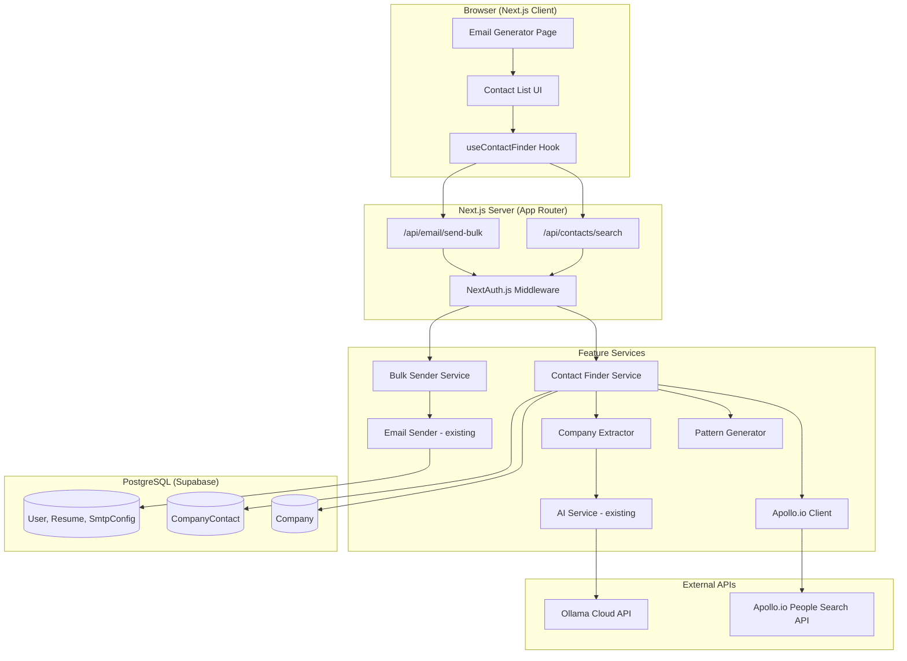
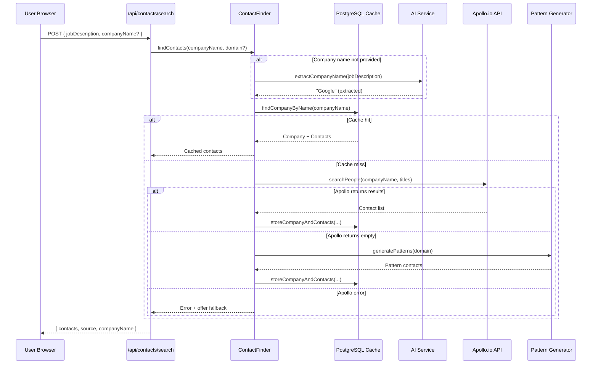

# Design Document: HR Contact Finder

## Overview

The HR Contact Finder extends the existing AI Job Dashboard to automate discovery of HR and Talent Acquisition contacts at target companies. It integrates into the existing Email Generator workflow, allowing users to find contacts, select recipients, and send bulk application emails — all from a single page.

### Key Design Decisions

1. **Feature-based directory**: New code lives in `src/features/hr-contact-finder/` following the existing pattern, with services, components, hooks, and types.
2. **Reuse existing infrastructure**: Leverages the existing AI service (`generateCompletion`), email sender (`sendEmail`), Prisma client, and auth middleware — no new external dependencies beyond the Apollo.io HTTP client.
3. **Cache-first architecture**: Every contact lookup checks PostgreSQL first, only calling Apollo.io on cache miss or explicit refresh. This minimizes API credit consumption.
4. **Sequential bulk sending**: Emails are sent one-at-a-time to respect SMTP rate limits, with real-time progress feedback to the user.
5. **Graceful degradation**: If Apollo.io is unavailable or returns no results, the system falls back to pattern-based email generation. If AI is unavailable, the user manually enters the company name.

## Architecture

### High-Level Integration Diagram



### Request Flow: Contact Search



### Directory Structure (New Files)

```
src/features/hr-contact-finder/
├── components/
│   ├── ContactList.tsx          # Contact rows with checkboxes
│   ├── ContactSearchBar.tsx     # Company name input + Find button
│   ├── BulkSendProgress.tsx     # Progress indicator during sending
│   └── ContactSourceBadge.tsx   # "Apollo" or "Pattern" badge
├── hooks/
│   └── useContactFinder.ts      # Client-side state management
├── services/
│   ├── contact-finder.service.ts    # Orchestrator: cache check → API → fallback
│   ├── apollo-client.service.ts     # Apollo.io API integration
│   ├── pattern-generator.service.ts # Fallback email pattern generation
│   ├── company-extractor.service.ts # AI-based company name extraction
│   └── bulk-sender.service.ts       # Sequential multi-recipient sending
└── types.ts                     # TypeScript interfaces

src/app/api/
├── contacts/
│   └── search/route.ts          # POST: find contacts for a company
└── email/
    └── send-bulk/route.ts       # POST: send to multiple recipients
```

## Components and Interfaces

### Contact Finder Service (Orchestrator)

```typescript
// src/features/hr-contact-finder/services/contact-finder.service.ts

interface ContactFinderService {
  findContacts(params: FindContactsParams): Promise<FindContactsResult>;
  refreshContacts(companyName: string): Promise<FindContactsResult>;
}

interface FindContactsParams {
  companyName?: string;
  jobDescription?: string;
  domain?: string;
}

interface FindContactsResult {
  contacts: Contact[];
  companyName: string;
  domain: string;
  source: 'cache' | 'apollo' | 'pattern';
  fromCache: boolean;
}
```

### Apollo.io Client

```typescript
// src/features/hr-contact-finder/services/apollo-client.service.ts

interface ApolloClientService {
  searchPeople(params: ApolloSearchParams): Promise<ApolloSearchResult>;
}

interface ApolloSearchParams {
  companyName: string;
  titles: string[];  // ["HR", "Talent Acquisition", "Recruiting", "Recruiter", "People Operations"]
  limit: number;     // max 10
}

interface ApolloSearchResult {
  contacts: ApolloContact[];
  hasMore: boolean;
}

interface ApolloContact {
  name: string;
  title: string;
  email: string;
}
```

### Pattern Generator

```typescript
// src/features/hr-contact-finder/services/pattern-generator.service.ts

interface PatternGeneratorService {
  generatePatterns(domain: string): Contact[];
  deriveDomain(companyName: string): string | null;
}
```

### Company Extractor

```typescript
// src/features/hr-contact-finder/services/company-extractor.service.ts

interface CompanyExtractorService {
  extractCompanyName(jobDescription: string): Promise<string | null>;
  sanitizeCompanyName(raw: string): string;
}
```

### Bulk Sender

```typescript
// src/features/hr-contact-finder/services/bulk-sender.service.ts

interface BulkSenderService {
  sendToMultiple(params: BulkSendParams): AsyncGenerator<BulkSendProgress>;
}

interface BulkSendParams {
  userId: string;
  recipients: string[];  // email addresses
  subject: string;
  body: string;
}

interface BulkSendProgress {
  current: number;
  total: number;
  recipientEmail: string;
  status: 'sending' | 'success' | 'failed';
  error?: string;
}

interface BulkSendResult {
  totalSent: number;
  totalFailed: number;
  results: Array<{
    email: string;
    success: boolean;
    error?: string;
  }>;
}
```

### Shared Types

```typescript
// src/features/hr-contact-finder/types.ts

interface Contact {
  id: string;
  name: string;
  title: string;
  email: string;
  source: 'apollo' | 'pattern';
  cachedAt: Date;
}

interface Company {
  id: string;
  name: string;
  domain: string;
  createdAt: Date;
}
```

### API Route Interfaces

```typescript
// POST /api/contacts/search
// Request:
interface ContactSearchRequest {
  companyName?: string;
  jobDescription?: string;
  domain?: string;
  refresh?: boolean;
}

// Response:
interface ContactSearchResponse {
  contacts: Contact[];
  companyName: string;
  domain: string;
  source: 'cache' | 'apollo' | 'pattern';
  extractedCompanyName?: string;  // if AI extracted it
}

// POST /api/email/send-bulk
// Request:
interface BulkSendRequest {
  recipients: string[];
  subject: string;
  body: string;
}

// Response (streamed via ReadableStream for progress):
interface BulkSendProgressEvent {
  type: 'progress' | 'complete';
  current?: number;
  total?: number;
  recipientEmail?: string;
  status?: 'success' | 'failed';
  error?: string;
  summary?: BulkSendResult;
}
```

### React Hook Interface

```typescript
// src/features/hr-contact-finder/hooks/useContactFinder.ts

interface UseContactFinderReturn {
  contacts: Contact[];
  isSearching: boolean;
  isSending: boolean;
  sendProgress: { current: number; total: number } | null;
  sendResults: BulkSendResult | null;
  error: string | null;
  companyName: string;
  selectedContacts: Set<string>;  // contact IDs
  
  searchContacts: (params: { companyName?: string; jobDescription?: string }) => Promise<void>;
  refreshContacts: () => Promise<void>;
  toggleContact: (contactId: string) => void;
  toggleAll: () => void;
  sendToSelected: (subject: string, body: string) => Promise<void>;
  setCompanyName: (name: string) => void;
  clearResults: () => void;
}
```

## Data Models

### New Prisma Models (added to existing schema)

```prisma
model Company {
  id        String   @id @default(cuid())
  name      String   @unique  // case-insensitive enforced at application layer
  domain    String
  createdAt DateTime @default(now())

  contacts CompanyContact[]
}

model CompanyContact {
  id        String   @id @default(cuid())
  companyId String
  name      String
  title     String
  email     String   @unique
  source    String   // "apollo" or "pattern"
  cachedAt  DateTime @default(now())

  company Company @relation(fields: [companyId], references: [id], onDelete: Cascade)

  @@index([companyId])
}
```

### Database Considerations

- **Case-insensitive lookup**: Application-layer normalization (`.toLowerCase()`) before querying, combined with storing normalized names. PostgreSQL `ILIKE` or Prisma `mode: 'insensitive'` for queries.
- **Cascade delete**: `onDelete: Cascade` on the `CompanyContact.company` relation ensures contacts are removed when a company is deleted.
- **Unique email constraint**: Prevents duplicate contacts across companies (same person at different companies would need separate handling, but for HR contacts this is acceptable).
- **No user association**: Companies and contacts are shared across all users since they represent public business information.

### Environment Variables (New)

```env
# Apollo.io API
APOLLO_API_KEY=<your-apollo-api-key>
```

This is the only new environment variable. All other configuration (database, AI service, SMTP) uses existing variables.

## Correctness Properties

*A property is a characteristic or behavior that should hold true across all valid executions of a system — essentially, a formal statement about what the system should do. Properties serve as the bridge between human-readable specifications and machine-verifiable correctness guarantees.*

### Property 1: Company name sanitization preserves valid characters

*For any* string input, the `sanitizeCompanyName` function SHALL return a string that is trimmed of leading/trailing whitespace and contains only alphanumeric characters, spaces, hyphens, ampersands, periods, and commas — removing all other special characters while preserving the meaningful content.

**Validates: Requirements 1.5**

### Property 2: Apollo response extraction completeness

*For any* valid Apollo.io API response containing people records, the extraction function SHALL produce a list of contacts where each contact has a non-empty name, a non-empty title, and a valid email address — never dropping required fields or producing partial contacts.

**Validates: Requirements 2.3**

### Property 3: Cache-first behavior prevents redundant API calls

*For any* company name that already exists in the Company_Cache with associated contacts, calling `findContacts` with that company name SHALL return the cached contacts and SHALL NOT invoke the Apollo.io API.

**Validates: Requirements 3.2, 8.1**

### Property 4: Case-insensitive company cache lookup

*For any* company name stored in the cache, looking it up with any case variation (uppercase, lowercase, mixed case) SHALL return the same company record and associated contacts.

**Validates: Requirements 3.6**

### Property 5: Pattern generation produces correct emails with correct source

*For any* valid domain string, the Pattern_Generator SHALL produce exactly 5 contacts with emails matching hr@{domain}, careers@{domain}, recruiting@{domain}, jobs@{domain}, and talent@{domain}, and every generated contact SHALL have its source field set to "pattern".

**Validates: Requirements 4.2, 4.3**

### Property 6: Domain derivation from company name

*For any* company name string, the `deriveDomain` function SHALL produce a result that is entirely lowercase, contains no spaces, has common suffixes (Inc, LLC, Ltd, Corp) removed, and ends with ".com" — or returns null if the input is empty after processing.

**Validates: Requirements 4.5**

### Property 7: Contact display contains all required fields

*For any* contact object rendered by the Contact_List_UI, the rendered output SHALL contain the contact's name, job title, email address, and a source indicator distinguishing Apollo-sourced from pattern-sourced contacts.

**Validates: Requirements 5.1**

### Property 8: Selection state consistency

*For any* list of contacts displayed in the Contact_List_UI, the displayed selected count SHALL always equal the number of contacts whose checkboxes are checked, and toggling "Select All" SHALL result in all contacts being selected (or all deselected if all were previously selected).

**Validates: Requirements 5.3, 5.5**

### Property 9: Bulk sender invokes email sender exactly once per recipient

*For any* list of selected recipient email addresses (1 to 10), the Bulk_Sender SHALL invoke the existing `sendEmail` function exactly once per recipient, with the correct email address, subject, and body for each invocation.

**Validates: Requirements 6.1**

### Property 10: Bulk send summary accuracy

*For any* list of recipients where each send either succeeds or fails, the final summary SHALL report a `totalSent` count equal to the number of successes, a `totalFailed` count equal to the number of failures, and the results array SHALL correctly categorize each recipient as succeeded or failed with the appropriate error message.

**Validates: Requirements 6.3, 6.4**

### Property 11: Progress indicator accuracy

*For any* bulk send operation with N total recipients, at step i (1 ≤ i ≤ N), the progress indicator SHALL display "Sending i of N..." accurately reflecting the current position in the sequence.

**Validates: Requirements 6.5**

## Error Handling

### Error Categories

| Scenario | HTTP Status | User Message | Fallback |
|----------|-------------|--------------|----------|
| Apollo.io API key missing | 500 | "Contact search is not configured" | Pattern-based fallback |
| Apollo.io timeout (15s) | 504 | "Contact search timed out" | Offer pattern fallback |
| Apollo.io rate limit (429) | 429 | "API limit reached for today" | Pattern-based fallback |
| Apollo.io credits exhausted (402) | 402 | "API credits exhausted" | Pattern-based fallback |
| Apollo.io other error | 502 | "Contact search failed" | Offer pattern fallback |
| AI extraction fails | 200 | (empty field, manual prompt) | Manual company name entry |
| AI service unavailable | 200 | "Auto-detection unavailable" | Manual company name entry |
| Domain cannot be derived | 200 | "Enter company domain" | Manual domain entry |
| SMTP not configured | 400 | "Configure SMTP in Settings" | — |
| Partial send failure | 207 | Per-recipient success/failure list | Retry failed only |
| No contacts found (Apollo + Pattern) | 200 | "No contacts found" | Manual email entry |

### Error Handling Strategy

**Apollo.io Client:**
- 15-second timeout via AbortController
- No retry on failure (unlike AI service) — single attempt per search
- On 429/402: log the event, return specific error code for UI to show fallback
- On network error: return generic error with fallback offer

**Company Extractor:**
- Wraps AI service call in try/catch
- Returns `null` on any failure (AI unavailable, parsing failure, timeout)
- Never blocks the user — they can always enter manually

**Bulk Sender:**
- Continues sending even if individual emails fail
- Collects per-recipient results
- Returns complete summary regardless of partial failures
- Does NOT retry failed sends automatically (user can retry manually)

**Cache Layer:**
- Database errors during cache write are logged but don't fail the request (contacts are still returned to user)
- Database errors during cache read fall through to Apollo.io API call

## Testing Strategy

### Testing Framework

- **Unit & Integration Tests**: Vitest (already configured)
- **Property-Based Tests**: fast-check (already in devDependencies)
- **Test Runner**: `vitest run` for CI, `vitest` for watch mode

### Property-Based Testing Configuration

- **Library**: fast-check
- **Minimum iterations**: 100 per property test
- **Tag format**: `Feature: hr-contact-finder, Property {number}: {property_text}`

Each correctness property (Properties 1–11) maps to a single property-based test using fast-check. Tests generate random inputs and verify the universal property holds across all generated cases.

### Test Structure

```
src/features/hr-contact-finder/
├── services/
│   ├── __tests__/
│   │   ├── contact-finder.service.test.ts      # Unit tests with mocked deps
│   │   ├── apollo-client.service.test.ts       # Unit tests with mocked fetch
│   │   ├── pattern-generator.service.test.ts   # Unit + property tests
│   │   ├── company-extractor.service.test.ts   # Unit tests with mocked AI
│   │   ├── bulk-sender.service.test.ts         # Unit + property tests
│   │   └── properties.test.ts                  # All property-based tests
```

### Property Test Mapping

| Property | Test File | Generator Strategy |
|----------|-----------|-------------------|
| 1: Sanitization | properties.test.ts | `fc.string()` with special chars |
| 2: Extraction | properties.test.ts | `fc.record()` mimicking Apollo response |
| 3: Cache-first | properties.test.ts | `fc.string()` for company names, mocked cache |
| 4: Case-insensitive | properties.test.ts | `fc.string()` with `fc.mixedCase()` |
| 5: Pattern generation | properties.test.ts | `fc.domain()` or `fc.string()` for domains |
| 6: Domain derivation | properties.test.ts | `fc.string()` with company name patterns |
| 7: Contact display | properties.test.ts | `fc.record()` for contact objects |
| 8: Selection state | properties.test.ts | `fc.array(fc.boolean())` for selection states |
| 9: Bulk invocation | properties.test.ts | `fc.array(fc.emailAddress())` |
| 10: Summary accuracy | properties.test.ts | `fc.array(fc.record({email, success}))` |
| 11: Progress indicator | properties.test.ts | `fc.nat()` for current/total |

### Unit Testing Focus

- Apollo client: correct request construction, response parsing, error handling for 429/402
- Pattern generator: specific domain examples, edge cases (empty string, special chars)
- Company extractor: AI prompt construction, response parsing, timeout handling
- Bulk sender: sequential execution order, partial failure handling
- Contact finder: orchestration logic (cache check → API → fallback flow)

### Integration Testing Focus

- Full API route tests (`/api/contacts/search`, `/api/email/send-bulk`)
- Database operations (Company/CompanyContact CRUD, cascade delete, unique constraints)
- End-to-end flow: search → cache → bulk send (with mocked external APIs)
