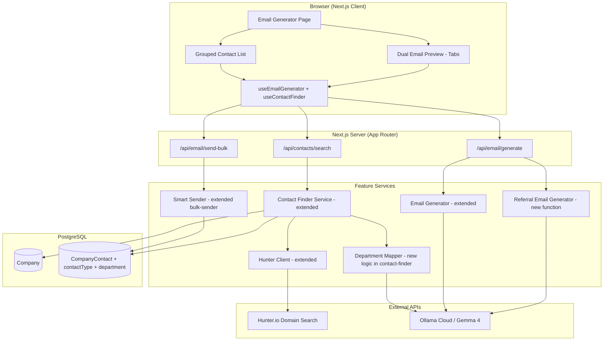
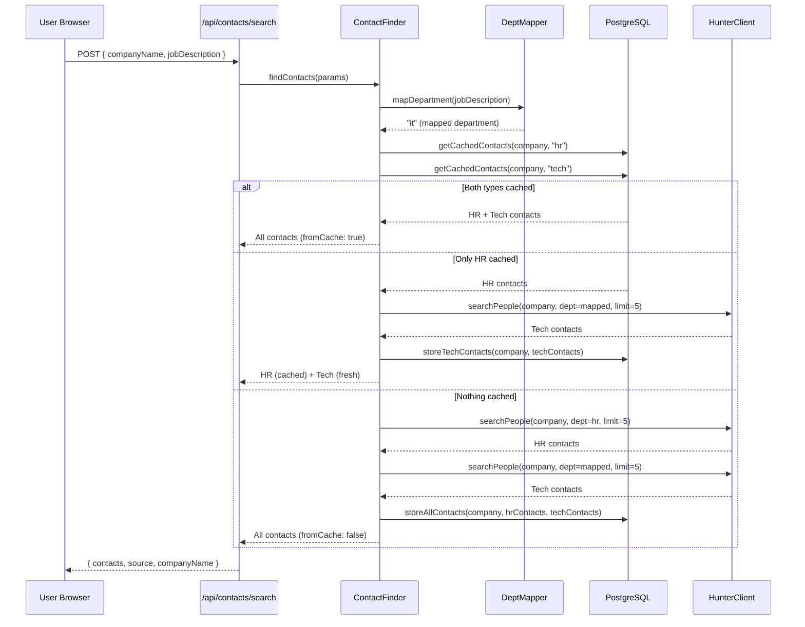
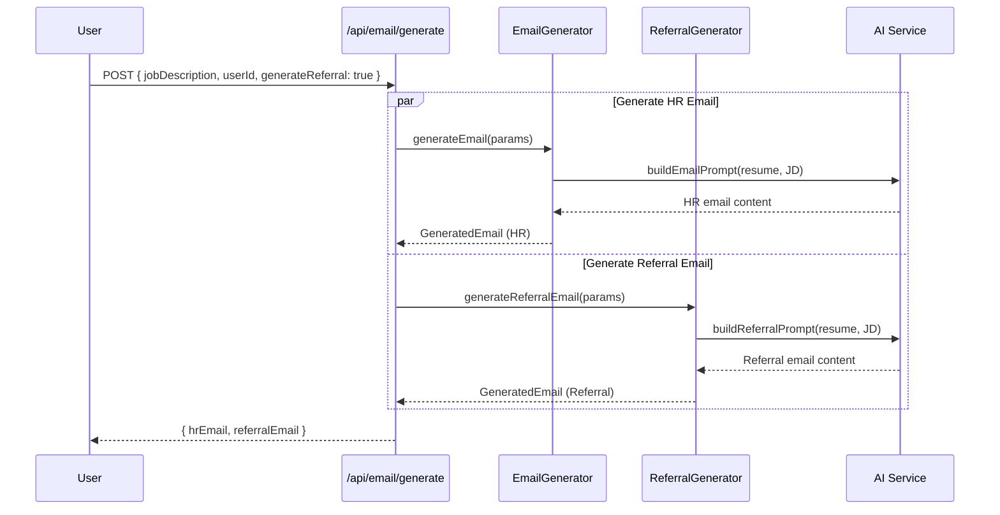

# Design Document: Referral Email System

## Overview

The Referral Email System extends the existing HR Contact Finder and Email Generator to support a dual-outreach strategy. It adds:

1. **Tech contact discovery** — a second Hunter.io API call per company search using a department filter mapped from the job description (e.g., "it", "design", "marketing")
2. **Referral email generation** — a new AI prompt that produces a concise, casual referral request email distinct from the formal HR application email
3. **Smart routing** — the bulk sender routes the correct email template to each contact based on their `contactType` field ("hr" → formal email, "tech" → referral email)

### Key Design Decisions

1. **Extend, don't replace**: All changes build on existing services (`hunter-client.service.ts`, `contact-finder.service.ts`, `email-generator.service.ts`). No new service files are created for core logic — instead, existing functions are extended with new parameters and branches.
2. **Two API calls, one search action**: A single user click triggers two Hunter.io domain-search requests (department=hr and department=mapped_value). This is transparent to the user.
3. **Department mapping via AI with keyword fallback**: The Department_Mapper first attempts keyword matching (fast, free). If inconclusive, it calls the AI service. This preserves API credits and keeps latency low for common cases.
4. **No pattern fallback for tech contacts**: Pattern generation (hr@, careers@, etc.) only makes sense for HR. Tech contact discovery relies solely on Hunter.io results.
5. **5 contacts per department per call**: Reduced from the previous 10-per-call limit to conserve the 25 searches/month free tier (each department search counts as one search).
6. **Referral email word limit enforced post-generation**: The AI prompt requests ≤150 words, and the service truncates if the AI exceeds it.

## Architecture

### Extended System Diagram



### Extended Contact Search Flow



### Email Generation Flow



## Components and Interfaces

### Extended Contact Type (types.ts)

The existing `Contact` interface in `src/features/hr-contact-finder/types.ts` is extended:

```typescript
export interface Contact {
  id: string;
  name: string;
  title: string;
  email: string;
  source: 'hunter' | 'pattern';
  confidence?: number;
  verified?: boolean;
  verificationStatus?: 'valid' | 'accept_all' | 'unknown' | 'invalid';
  cachedAt: Date;
  contactType: 'hr' | 'tech';      // NEW
  department?: string;              // NEW — Hunter.io department value
}
```

### Extended FindContactsParams

```typescript
export interface FindContactsParams {
  companyName?: string;
  jobDescription?: string;
  domain?: string;
  location?: string;
}
// No change to params — jobDescription is already present and will now
// also be used for department mapping
```

### Extended FindContactsResult

```typescript
export interface FindContactsResult {
  contacts: Contact[];          // Now includes both HR and tech contacts
  companyName: string;
  domain: string;
  source: 'cache' | 'hunter' | 'pattern';
  fromCache: boolean;
  mappedDepartment?: string;    // NEW — the Hunter.io department used for tech search
}
```

### Department Mapper (new logic in contact-finder.service.ts)

```typescript
/**
 * Maps a job description to a Hunter.io department filter value.
 * Uses keyword matching first, falls back to AI if inconclusive.
 */
export async function mapDepartment(jobDescription: string): Promise<string>;

// Valid return values (Hunter.io supported departments):
type HunterDepartment = 
  | 'executive' | 'it' | 'finance' | 'management' 
  | 'sales' | 'legal' | 'support' | 'hr' 
  | 'marketing' | 'communication' | 'education' 
  | 'design' | 'health' | 'operations';
```

### Referral Email Generator (new function in email-generator.service.ts)

```typescript
export interface ReferralEmailParams {
  userId: string;
  jobDescription: string;
}

export interface GeneratedReferralEmail {
  subject: string;
  greeting: string;
  body: string;
  closing: string;
  fullContent: string;
}

/**
 * Generates a casual, professional referral request email.
 * Uses the same AI service as the HR email generator.
 * Enforces 150-word body limit.
 */
export async function generateReferralEmail(
  params: ReferralEmailParams
): Promise<GeneratedReferralEmail>;
```

### Extended Bulk Sender (smart routing)

```typescript
export interface SmartBulkSendParams {
  userId: string;
  recipients: Array<{
    email: string;
    contactType: 'hr' | 'tech';
  }>;
  hrEmail: {
    subject: string;
    body: string;
  };
  referralEmail: {
    subject: string;
    body: string;
  };
}

export interface SmartBulkSendProgress {
  current: number;
  total: number;
  recipientEmail: string;
  contactType: 'hr' | 'tech';
  status: 'sending' | 'success' | 'failed';
  error?: string;
}

export interface SmartBulkSendResult {
  totalHrSent: number;
  totalReferralSent: number;
  totalFailed: number;
  results: Array<{
    email: string;
    contactType: 'hr' | 'tech';
    success: boolean;
    error?: string;
  }>;
}
```

### Extended API Route: /api/email/generate

```typescript
// Request — extended with generateReferral flag
interface EmailGenerateRequest {
  jobDescription: string;
  hrEmail?: string;
  generateReferral?: boolean;  // NEW — defaults to true
}

// Response — extended with referralEmail
interface EmailGenerateResponse {
  hrEmail: GeneratedEmail;
  referralEmail?: GeneratedReferralEmail;  // NEW — present when generateReferral=true
}
```

### Extended API Route: /api/email/send-bulk

```typescript
// Request — extended for smart routing
interface BulkSendRequest {
  recipients: Array<{
    email: string;
    contactType: 'hr' | 'tech';
  }>;
  hrEmail: {
    subject: string;
    body: string;
  };
  referralEmail: {
    subject: string;
    body: string;
  };
}

// Response stream events — extended with contactType
interface BulkSendProgressEvent {
  type: 'progress' | 'complete';
  current?: number;
  total?: number;
  recipientEmail?: string;
  contactType?: 'hr' | 'tech';   // NEW
  status?: 'success' | 'failed';
  error?: string;
  summary?: SmartBulkSendResult;  // NEW — includes type breakdown
}
```

### UI Component Changes

**Email Generator Page** (`src/app/(dashboard)/email-generator/page.tsx`):
- Add tabbed email preview (Tab 1: "HR Application Email", Tab 2: "Referral Request Email")
- Both emails generated from single "Generate" click
- Independent loading states per tab

**Contact List** (`src/features/hr-contact-finder/components/ContactList.tsx`):
- Group contacts into "HR Contacts" and "Tech Contacts" sections
- Add per-group "Select All" checkbox
- Show template routing label under each group header
- Display contactType badge per contact row
- Show total selected count across both groups

**Bulk Send Progress** (`src/features/hr-contact-finder/components/BulkSendProgress.tsx`):
- Show contactType in progress message (e.g., "Sending 2 of 7 — Tech contact")
- Extended summary with HR sent / Referral sent / Failed breakdown

## Data Models

### Prisma Schema Changes (prisma/schema.prisma)

The `CompanyContact` model is extended with two new fields:

```prisma
model CompanyContact {
  id          String   @id @default(cuid())
  companyId   String
  name        String
  title       String
  email       String   @unique
  source      String
  contactType String   @default("hr")   // NEW: "hr" or "tech"
  department  String   @default("hr")   // NEW: Hunter.io department value
  cachedAt    DateTime @default(now())

  company Company @relation(fields: [companyId], references: [id], onDelete: Cascade)

  @@index([companyId])
  @@index([companyId, contactType])  // NEW: for filtered queries
}
```

### Migration Strategy

- Add `contactType` column with `@default("hr")` — existing records automatically get "hr" (backward compatible)
- Add `department` column with `@default("hr")` — existing records get "hr" department
- Add composite index `@@index([companyId, contactType])` for efficient filtered queries
- No data migration needed — defaults handle existing records

### Department Mapping Keyword Table

The Department_Mapper uses this keyword-to-department mapping for fast local matching:

| Keywords in JD | Hunter.io Department |
|---|---|
| software engineer, developer, web, backend, frontend, full-stack, DevOps, SRE, data engineer, data scientist, QA, test engineer, cloud, infrastructure | `it` |
| graphic design, UX, UI design, product design, visual design, interaction design | `design` |
| sales, business development, account manager, account executive, SDR, BDR | `sales` |
| marketing, content, SEO, growth, digital marketing, brand | `marketing` |
| finance, accounting, FP&A, controller, treasury, audit | `finance` |
| legal, compliance, counsel, paralegal, regulatory | `legal` |
| executive, CEO, CTO, VP, director, chief | `executive` |
| operations, supply chain, logistics, procurement | `operations` |
| customer support, customer success, helpdesk, technical support | `support` |
| HR, recruiter, talent acquisition, people operations | `hr` |
| communications, PR, public relations, media | `communication` |
| health, medical, clinical, healthcare, nurse, physician | `health` |
| education, training, learning, instructor, professor | `education` |
| project manager, program manager, product manager, scrum master | `management` |

Default: `it` (when no keywords match)

## Correctness Properties

*A property is a characteristic or behavior that should hold true across all valid executions of a system — essentially, a formal statement about what the system should do. Properties serve as the bridge between human-readable specifications and machine-verifiable correctness guarantees.*

### Property 1: Department mapping always returns a valid Hunter.io department

*For any* job description string (including empty strings and strings with no recognizable role keywords), the `mapDepartment` function SHALL return exactly one value from the set {executive, it, finance, management, sales, legal, support, hr, marketing, communication, education, design, health, operations}.

**Validates: Requirements 1.2, 1.3, 7.6**

### Property 2: Dual API call orchestration with correct department filters

*For any* company name and job description where the cache is empty, the Contact_Finder SHALL invoke the Hunter_Client exactly twice — once with department="hr" and once with the department value returned by the Department_Mapper — each with a limit parameter of at most 5.

**Validates: Requirements 1.1, 1.4, 1.5**

### Property 3: Contact type assignment matches discovery department

*For any* set of contacts returned by the Hunter_Client from a department="hr" search, all contacts SHALL have contactType="hr". For any set of contacts returned from any other department search, all contacts SHALL have contactType="tech".

**Validates: Requirements 1.6, 1.7**

### Property 4: Contact data round-trip persistence

*For any* contact with a valid contactType ("hr" or "tech") and a valid department value, storing it in the Company_Cache and then retrieving it SHALL return a contact with identical contactType, department, name, title, and email fields.

**Validates: Requirements 2.1, 2.2, 2.3**

### Property 5: Cache filtering by contactType

*For any* company with a mix of HR and tech contacts stored in the Company_Cache, querying with contactType="hr" SHALL return only contacts where contactType="hr", and querying with contactType="tech" SHALL return only contacts where contactType="tech".

**Validates: Requirements 2.4**

### Property 6: Referral email is distinct from HR email

*For any* job description and resume pair, the generated referral email subject and body SHALL differ from the generated HR application email subject and body (they are not string-equal).

**Validates: Requirements 3.1**

### Property 7: Referral email body word count constraint

*For any* generated referral email, the body field SHALL contain at most 150 words (where words are delimited by whitespace).

**Validates: Requirements 3.5**

### Property 8: Smart routing correctness

*For any* list of selected contacts with mixed contactTypes, the Smart_Sender SHALL send the HR email template to every contact where contactType="hr" and the referral email template to every contact where contactType="tech" — never sending the wrong template to any contact.

**Validates: Requirements 6.1, 6.2**

### Property 9: Send summary accuracy with type breakdown

*For any* list of recipients where each send either succeeds or fails, the final summary SHALL report `totalHrSent` equal to the number of successful HR sends, `totalReferralSent` equal to the number of successful tech sends, and `totalFailed` equal to the total failures, with the results array correctly categorizing each recipient.

**Validates: Requirements 6.4, 6.5**

### Property 10: Progress indicator accuracy with contact type

*For any* smart bulk send operation with N total recipients, at step i (1 ≤ i ≤ N), the progress event SHALL accurately report `current=i`, `total=N`, and the correct `contactType` for the current recipient.

**Validates: Requirements 6.6**

### Property 11: Per-group selection state consistency

*For any* list of contacts displayed in two groups (HR and tech), clicking "Select All" within the HR group SHALL result in all HR contacts selected and tech contacts unchanged, and vice versa. The displayed total selected count SHALL always equal the actual number of contacts with checked checkboxes across both groups.

**Validates: Requirements 5.5, 5.6**

### Property 12: Cache-aware API optimization

*For any* company where the cache contains contacts of one type only (either HR or tech), calling `findContacts` SHALL make exactly one Hunter.io API call for the missing type only. When both types are cached, zero API calls SHALL be made. When neither type is cached, exactly two API calls SHALL be made.

**Validates: Requirements 8.1, 8.2, 8.3, 8.5**

## Error Handling

### Error Categories (Extended)

| Scenario | HTTP Status | User Message | Fallback |
|----------|-------------|--------------|----------|
| Hunter.io returns no tech contacts | 200 | "No tech contacts found for this department" | No fallback — tech has no pattern generation |
| Department mapping AI fails | 200 | (silent) | Defaults to "it" department |
| Department mapping returns invalid value | 200 | (silent) | Defaults to "it" department |
| Referral email AI generation fails | 503 | "Referral email generation failed. Please retry." | User can retry; HR email unaffected |
| Referral email exceeds 150 words | 200 | (silent — auto-truncated) | Truncate to 150 words at sentence boundary |
| Hunter.io rate limit on second call | 429 | "API limit reached" | First call results (HR or tech) still returned |
| Bulk send partial failure (mixed types) | 207 | Per-recipient success/failure with type | Continue sending remaining |
| Cache write fails for new fields | 200 | (silent — logged) | Contacts still returned to user |

### Error Handling Strategy (Extensions)

**Department Mapper:**
- Keyword matching is a pure function — cannot fail
- AI fallback wraps in try/catch; returns "it" on any error
- Never blocks the contact search flow

**Referral Email Generator:**
- Independent from HR email generation — failure of one does not block the other
- On AI failure: returns error to UI, user can retry independently
- On word count violation: truncates at the last complete sentence within 150 words

**Smart Sender:**
- Template selection is a pure lookup on contactType — cannot fail
- If contactType is missing/invalid on a contact, defaults to "hr" template
- Continues sending to all recipients regardless of individual failures

**Cache Updates:**
- Schema migration adds columns with defaults — no runtime migration errors
- If new columns fail to write (shouldn't happen with defaults), contacts are still returned

## Testing Strategy

### Testing Framework

- **Unit & Integration Tests**: Vitest (configured in `package.json`)
- **Property-Based Tests**: fast-check v4.8.0 (already in devDependencies)
- **Test Runner**: `vitest run` for CI

### Property-Based Testing Configuration

- **Library**: fast-check
- **Minimum iterations**: 100 per property test
- **Tag format**: `Feature: referral-email-system, Property {number}: {property_text}`

Each correctness property (Properties 1–12) maps to a single property-based test. Tests generate random inputs and verify the universal property holds.

### Test File Structure

```
src/features/hr-contact-finder/services/__tests__/
├── department-mapper.test.ts          # Unit tests for keyword matching + AI fallback
├── contact-finder.extended.test.ts    # Unit tests for dual-search orchestration
├── smart-sender.test.ts               # Unit tests for template routing logic

src/features/email/services/__tests__/
├── referral-generator.test.ts         # Unit tests for referral email generation

src/features/hr-contact-finder/__tests__/
├── properties.test.ts                 # All 12 property-based tests
```

### Property Test Mapping

| Property | Generator Strategy |
|----------|-------------------|
| 1: Dept mapping validity | `fc.string()` with random JD content, including edge cases |
| 2: Dual API orchestration | `fc.record({ companyName: fc.string(), jd: fc.string() })`, mocked Hunter client |
| 3: Contact type assignment | `fc.array(fc.record(...))` mimicking Hunter.io responses + department param |
| 4: Cache round-trip | `fc.record({ contactType: fc.constantFrom('hr','tech'), department: fc.constantFrom(...validDepts) })` |
| 5: Cache filtering | `fc.array(fc.record({...}))` with mixed contactTypes, store and filter |
| 6: Referral distinctness | `fc.record({ jd: fc.string({minLength:50}), resume: fc.string({minLength:50}) })`, mock AI with deterministic but distinct outputs |
| 7: Word count | `fc.string()` for referral body content, verify post-processing enforces limit |
| 8: Smart routing | `fc.array(fc.record({ email: fc.emailAddress(), contactType: fc.constantFrom('hr','tech') }))` |
| 9: Summary accuracy | `fc.array(fc.record({ email, contactType, success: fc.boolean() }))` |
| 10: Progress accuracy | `fc.nat({max:20})` for total, `fc.nat()` for current position |
| 11: Selection state | `fc.record({ hrCount: fc.nat({max:10}), techCount: fc.nat({max:10}), selectedIndices: fc.array(...) })` |
| 12: Cache optimization | `fc.record({ hasHr: fc.boolean(), hasTech: fc.boolean() })`, mock cache state |

### Unit Testing Focus

- **Department Mapper**: keyword matching for each category, AI fallback behavior, invalid AI responses
- **Referral Generator**: prompt construction, response parsing, word count enforcement, truncation logic
- **Contact Finder (extended)**: dual-search orchestration, partial cache hit handling, refresh behavior
- **Smart Sender**: template selection per recipient, sequential execution, mixed failure handling
- **UI Components**: grouped rendering, per-group select all, tab switching, independent loading states

### Integration Testing Focus

- Full `/api/contacts/search` with dual-search and caching (mocked Hunter.io)
- Full `/api/email/generate` with both email types (mocked AI)
- Full `/api/email/send-bulk` with smart routing (mocked SMTP)
- Database migration: verify existing records get default "hr" contactType
- End-to-end flow: search → cache → generate both emails → smart bulk send
